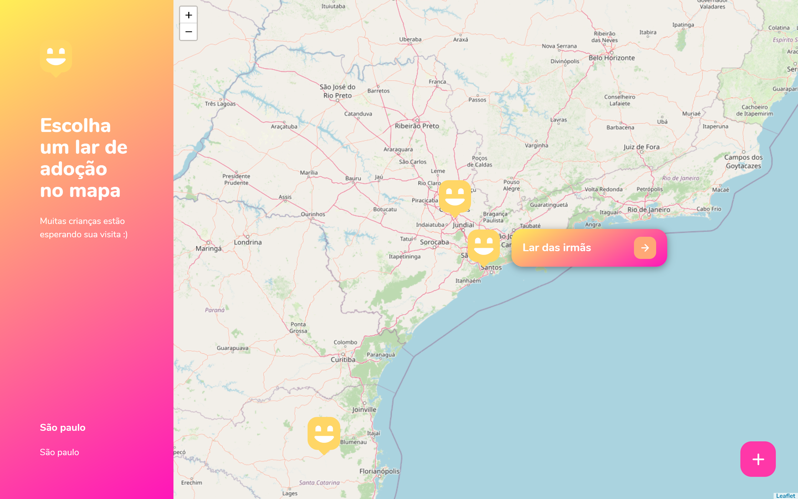
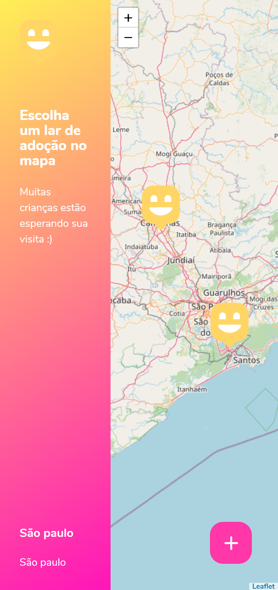
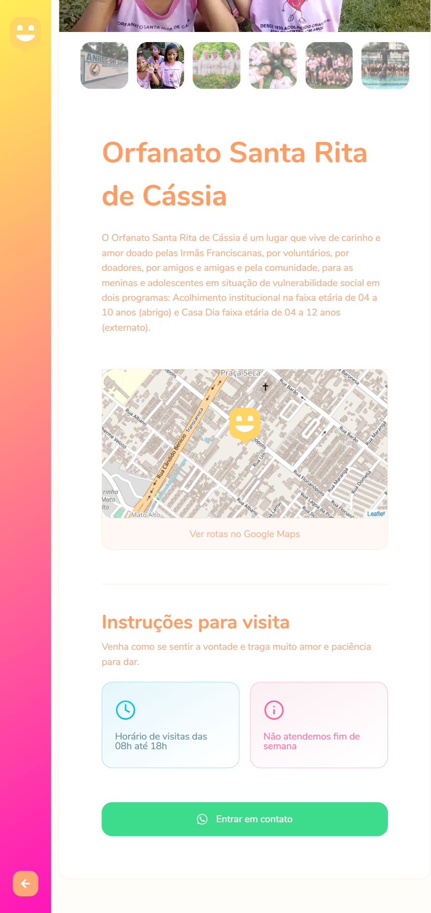
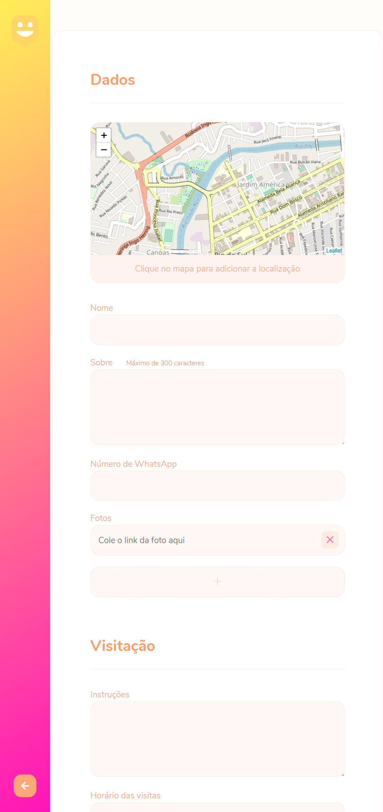

<h1 align="center">
    <br>
    
</h1>
<!-- <h4 align="center">Projeto web construído durante o Next Level Week #03-Discovery com a Rocketseat/maykbrito.</h4> -->
<p align="center">
    
    <a aria-label="Completado" href="https://nextlevelweek.com/episodios/omnistack/edicao/3">
        </img>
    </a>
    
    <a href="https://github.com/NyctibiusVII/Happy/blob/master/LICENSE">
        
    </a>
    <a href="https://picpay.me/Matheus_nyctibius_vii">
        
    </a>
</p>
<p align="center">
    <a href="#happy-">Projeto</a>&nbsp;&nbsp;&nbsp;|&nbsp;&nbsp;&nbsp;
    <a href="#tecnologias-">Tecnologias</a>&nbsp;&nbsp;&nbsp;|&nbsp;&nbsp;&nbsp;
    <a href="#layout-">Layout</a>&nbsp;&nbsp;&nbsp;|&nbsp;&nbsp;&nbsp;
    <a href="#licença-%EF%B8%8F">Licença</a>
</p>
<p align="center">
    <a href="README.md">Inglês</a>
    ·
    <a href="README-pt.md">Português</a>
</p>

# Happy 
Projeto desenvolvido para levar felicidade ao mundo, conectando mais pessoas a crianças em lares adotivos. Projeto realizado na Next Level Week #3 @Rocketseat.

#### Funcionalidades
* Site de inscrição para lares adotivos.
* Site para localizar lares adotivos próximos à sua região.

## Tecnologias 🚀
Esse projeto foi desenvolvido com as seguintes tecnologias:

- [Nodemon | ^2.0.5](https://nodejs.org/en/)
- [Express | ^4.17.1](https://expressjs.com/pt-br/)
- [Handlebars | ^4.1.1](https://handlebarsjs.com/)
- [SQLite | ^1.1.0](https://www.sqlite.org/index.html)
- [x0popup | ^0.3.3](https://gao-sun.github.io/x0popup/)

## Layout 🚧
#### Desktop Screenshot
<div style="display: flex; flex-direction: 'column'; align-items: 'center';">
<!-- Responsive, 1440 x 900, 50% (Laptop L - 1440px)-->
    
    
</div>

#### Mobile Screenshot
<div style="display: flex; flex-direction: 'row';">
<!-- Responsive, 425 x 900, 60% (Mobile L - 425px)-->
    
    
    
    
</div>

## Rodando o projeto 🚴🏻‍♂️

#### Na sua maquina:
<details>
    <summary>Dependências</summary>

```json
  "dependencies": {
    "express": "^4.17.1",
    "hbs": "^4.1.1",
    "nodemon": "^2.0.5",
    "sqlite-async": "^1.1.0",
    "x0popup": "^0.3.3"
  }
```
</details>

```bash
# Clone o repositório
$ git clone https://github.com/NyctibiusVII/Happy.git

# Acesse a pasta do projeto no prompt de comando
$ cd happy

# Instale as dependências
$ npm install

# Execute o script "start"
$ npm start

# O projeto inciará na porta: 5503 - acesse http://localhost:5503
```

## Contribuição 💭
Para construir essa aplicação tive a ajuda do professor **Maykbrito** da Rocketseat que disponibilizou video aulas do projeto **Happy** e tive uma ajuda desta grande comunidade que a Rocketseat construiu no *Discord*.
Feito com ♥ by Rocketseat :wave: [Participe da nossa comunidade!](https://discord.gg/YxU7fJT)

Confira a [Contribuição](./CONTRIBUTING-pt.md) para ver como iniciar uma discussão e começar a contribuir.

## Licença ⚖️
Este projeto está sob a licença do MIT. Veja o arquivo [LICENSE](https://github.com/NyctibiusVII/Happy/blob/master/LICENSE) para mais detalhes.

## Contato ✉️
| <br><sub><a href="https://www.instagram.com/nyctibius_vii/?hl=pt-br">@MatheusVidigal🦊</a></sub> |
| :---: |

<p align="left">
   <a href="https://www.linkedin.com/in/matheus-vidigal-nyctibiusvii/">
      
   </a>
   <a href="https://mail.google.com/mail/u/1/#inbox?compose=GTvVlcSGLCKpKJfwPsKKqzXBplKkGtCLvCQcFWdWxCxQFfkHzzjVkgzrMFPBgKBmWFHvrjrCsMqSH">
      
   </a>
</p>