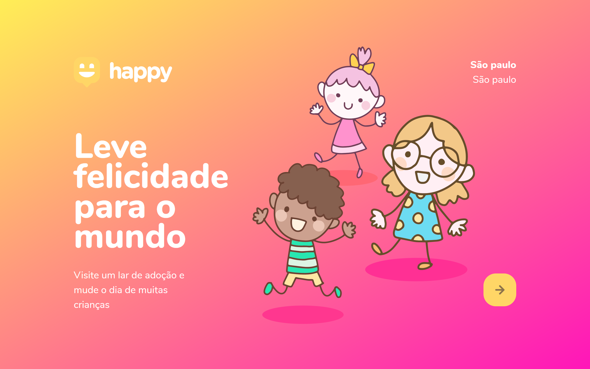
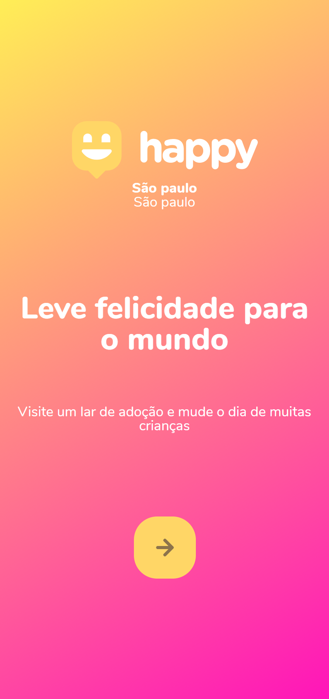
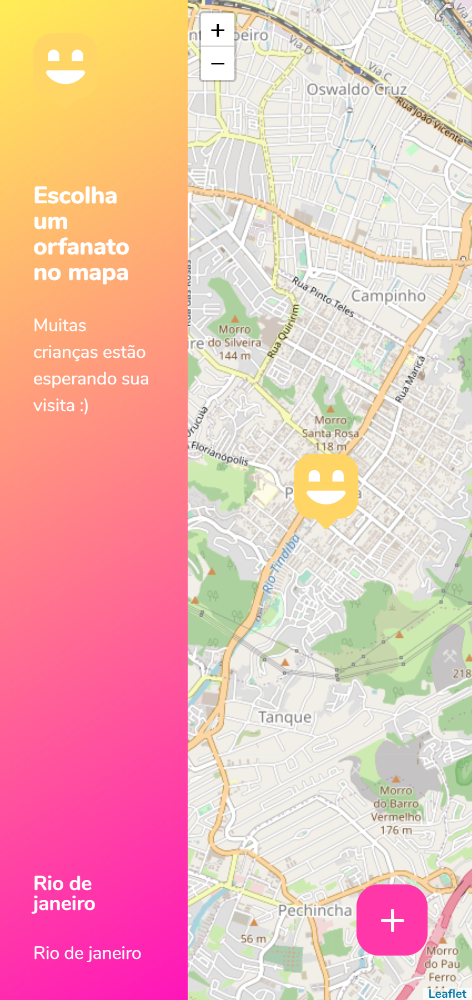
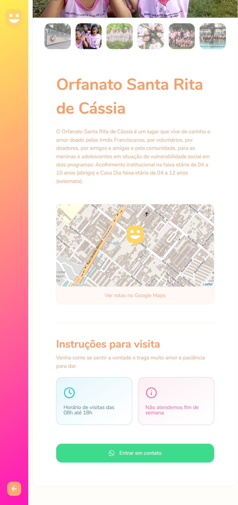
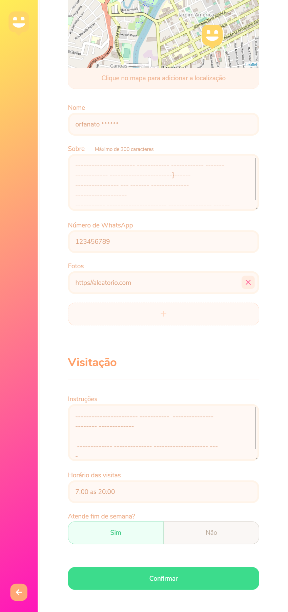

<h1 align="center">
  <br>
    
</h1>
<!-- <h4 align="center">Projeto web construído durante o Next Level Week #03-Discovery com a Rocketseat/maykbrito.</h4> -->
<p align="center">
  <a href="">
    
  </a>
  <a aria-label="Completed" href="https://nextlevelweek.com/episodios/omnistack/edicao/2">
    </img>
  </a>
  
  <a href="https://github.com/NyctibiusVII/NLW-3-Discovery/blob/master/LICENSE">
    
  </a>
  <a href="https://picpay.me/Matheus_nyctibius_vii">
  
  </a>
</p>
<p align="center">
  <a href="#Happy-">Project</a>&nbsp;&nbsp;&nbsp;|&nbsp;&nbsp;&nbsp;
  <a href="#technology-">Technology</a>&nbsp;&nbsp;&nbsp;|&nbsp;&nbsp;&nbsp;
  <a href="#layout-">Layout</a>&nbsp;&nbsp;&nbsp;|&nbsp;&nbsp;&nbsp;
  <a href="#license-%EF%B8%8F">License</a>
</p>
<p align="center">
    <a href="README.md">Inglês</a>
    ·
    <a href="README-pt.md">Português</a>
</p>

# Happy 
Project developed to bring happiness to the world, connecting more people to orphanage children. Project carried out at Next Level Week #3 @Rocketseat.

#### Functionalities
* Site for registering orphanages.
* App to locate orphanages near your region.

## Technology 🚀
This project was developed with the following technologies:

- [Node.js](https://nodejs.org/en/)
- [Express](https://expressjs.com/pt-br/)
- [Handlebars](https://handlebarsjs.com/)
- [SQLite](https://www.sqlite.org/index.html)
- [Nunjucks](https://mozilla.github.io/nunjucks/)

## Layout 🚧
#### Web Screenshot
<div style="display: flex; flex-direction: 'column'; align-items: 'center';">
<!-- Responsive, 1440 x 900, 50% (Laptop L - 1440px)-->
   
   
</div>

#### Mobile Screenshot
<div style="display: flex; flex-direction: 'row';">
<!-- Responsive, 425 x 900, 60% (Mobile L - 425px)-->
   
   
   
   
</div>

## Running the project 🚴🏻‍♂️

```bash

# Clone the repository
$ git clone https://github.com/NyctibiusVII/NLW-3-Discovery.git

# Access the project folder at the command prompt
$ cd NLW3

# Install the dependencies
$ npm install

# Run the script "dev"
$ npm run dev

# The project will start at the door: 5503 - acesse http://localhost:5503 
# working in progress...
```

## Contribution 💭
To build this application I had the help of the teacher **Maykbrito** from Rocketseat that provided video lessons of the project **NLW#3-Discovery** and I had help from this great community that Rocketseat built in *Discord*.
Done with ♥ by Rocketseat :wave: [Join our community!](https://discord.gg/YxU7fJT)

Check out the [Contribution](./CONTRIBUTING.md) to see how to start a discussion and start contributing.

## License ⚖️
This project is under the MIT license. See the archive [LICENSE](https://github.com/NyctibiusVII/NLW-3-Discovery/blob/master/LICENSE) for more details.

## Contact ✉️
| <br><sub><a href="https://www.instagram.com/nyctibius_vii/?hl=pt-br">@MatheusVidigal🦊</a></sub> |
| :---: |

<p align="left">	
   <a href="https://www.linkedin.com/in/matheus-vidigal-nyctibiusvii/">
      
   </a>
   <a href="https://mail.google.com/mail/u/1/#inbox?compose=GTvVlcSGLCKpKJfwPsKKqzXBplKkGtCLvCQcFWdWxCxQFfkHzzjVkgzrMFPBgKBmWFHvrjrCsMqSH">
      
   </a>
</p>
<!-- amarelo: #ffd666 -->